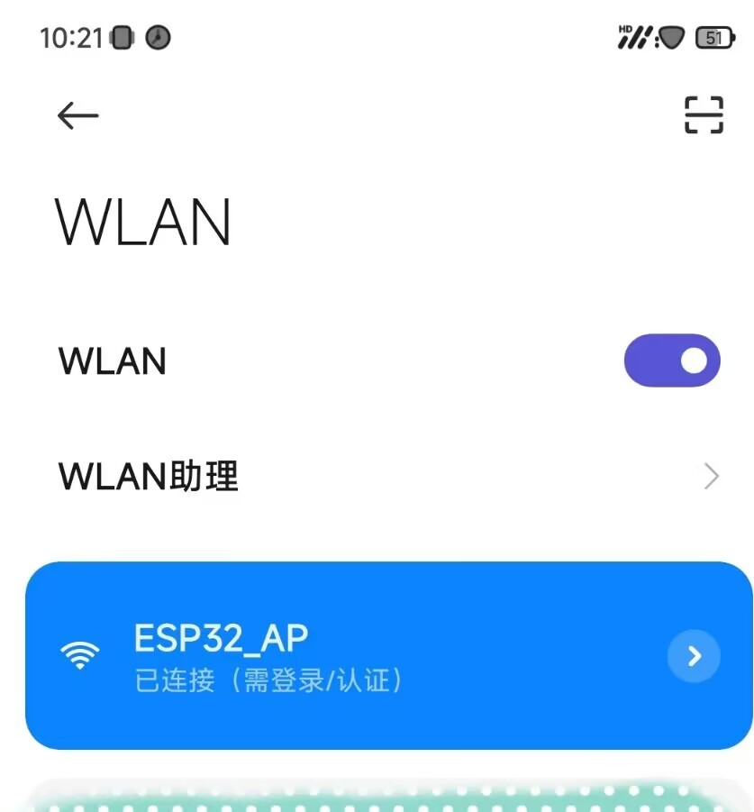
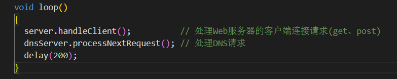
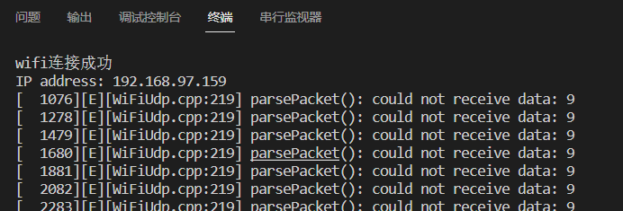

强制门户：连接上wifi后，自动打开一个网页
### EEPROM和Flash的区别
1. 擦除方式：EEPROM需要逐个字节地擦除，而Flash可以在大块中擦除，这使得Flash的擦除速度比EEPROM更快。
2. 存储密度：Flash的存储密度比EEPROM更高。Flash存储器通常比EEPROM大得多，并且可以存储更多的数据。
3. 电源管理：EEPROM和Flash存储器在断电时的表现也不同。EEPROM可以在断电时保持数据不变，而Flash需要定期刷新以防止数据丢失。
4. 使用寿命：Flash的擦除次数比EEPROM多。EEPROM的擦除次数通常为10万次左右，而Flash的擦除次数通常为100万次左右。
5. 成本：由于Flash的生产成本更低，因此它通常比EEPROM更便宜。
### EEPROM
* ROM：Read only memory，只读存储器,**断电仍可保存数据**
* PROM：可编程ROM
* EPROM：可擦除可编程ROM，通过紫外光的照射擦除原先的程序
* EEPROM：电可擦编程只读存储器(Electrically Erasable Programmable Read-Only Memory)，通过电子擦除数据
* RAM：Random-access memory，随机存储器，断电数据丢失
* **特点：写的速度比较慢(一次最快为3.3~5ms),读的速度较快。写有次数限制(10万次左右)，读无次数限制。**
#### 查看芯片EEPROM的大小
```c
#include <EEPROM.h>

void setup() {
  Serial.begin(9600);
}

void loop() {
  int eepromSize = EEPROM.length();
  Serial.print("EEPROM大小为：");
  Serial.print(eepromSize);
  Serial.println("字节");
  delay(5000); // 每隔5秒更新一次
}
// ESP系列运行结果为0
```
<mark>esp32实际上没有eeprom, 使用flash模拟的</mark>
| Microcontroller             | EEPROM     |
| --------------------------- | ---------- |
| Atmega 328(Uno、Nano、Mini) | 1024 bytes |
| Atmega 168(Nano)            | 512 bytes  |
| Atmega 2560(Arduino Mega)   | 4096 bytes |
* **每个地址占1byte，1byte = 8bit，数据范围：0~255**
* 字符串Arduino:大小为7个byte，一个字符为1byte。
* 汉字：大小为4 bytes，一个汉字为2个英文字符，也就是2 bytes
* 1K(1024 bytes)的EEPROM，可用地址为0~1023
#### EEPROM读写操作
* `EEPROM.begin(512)`：ESP8266/32使用Flash模拟出EEPROM的空间大小，最好为4的倍数
* `EEPROM.put()`:EEPROM.write()函数每次只能写入一个字节的数据到EEPROM。而大部分数据类型占用的字节数量都是超过1个字节的。如浮点型数据，整形数据等。EEPROM.put()函数允许我们向EEPROM写入多字节的数据。语法：`EEPROM.put(address, var)`
* EEPROM.commit():每次写操作完成后，进行提交，执行保存操作。功能相同 EEPROM.end();
* `EEPROM.get()`:EEPROM.read()函数每次只能读取一个字节的数据。而大部分数据类型占用的字节数量都是超过1个字节的，如浮点型数据，整形数据等。EEPROM.get()函数允许用户一次获取多个字节的数据。这就允许我们向EEPROM存储带有小数点的浮点型数据或整数型数据以及其它数据类型。语法：`EEPROM.get(address, var)`
#### EEPROM格式化
第一次使用时，先进行格式化
```c
#include <EEPROM.h>

void setup()
{
  EEPROM.begin(512);
  // write a 0 to all 512 bytes of the EEPROM
  for (int i = 0; i < 512; i++)
  {
    EEPROM.write(i, 0);
  }
  // turn the LED on when we're done
  pinMode(13, OUTPUT);
  digitalWrite(13, HIGH);
  EEPROM.end(); // 同EEPROM.commit();
}

void loop()
{
}
```
读写基本测试
```c++
#include <Arduino.h>
#include <EEPROM.h>

String ssid = "leisure";
String password = "shadow27";
String test;

void setup()
{
  Serial.begin(9600);
  EEPROM.begin(512);
  EEPROM.put(10, ssid);
  EEPROM.commit();
  EEPROM.get(10, test);
}

void loop()
{
    Serial.println(test);
    delay(1000);
}
```
### LittleFS闪存文件系统
ESP32 LittleFS文件系统，在未来的某个版本中将取代SPIFFS文件系统。目前SPIFFS系统已停止维护更新。LittleFS支持文件目录，并且对于大多数操作来说速度更快。SPIFFS使用方法与LittleFS兼容。注：ESP32自带的SPIFFS.h文件管理系统是没有文件层级的，比如建立一个/doc/test.txt的文件，那么这个文件的名字就是/doc/test，而不是根目录下有个test.txt
* SPIFFS：Peripheral Interface Flash File System，外围接口闪存文件系统
#### 使用Platformio开发闪存文件系统
1. 在工程文件中创建一个data文件(与src同级)，在里放需要的文件。

2. 编译并上传闪存文件：

3. 编译并上传整个工程文件
#### SPIFFS相关函数(LittleFS兼容)
* LittleFS.begin()、SPIFFS.begin(); // 开启SPIFFS
* SPIFFS.open("/index.html", "r") // 创建或打开文件,"r"代表读操作，"w"代表读操作
```c++
File dataFile = SPIFFS.open(file_name, "w");// 建立File对象用于向SPIFFS中的file对象（即/notes.txt）写入信息
// 此操作将会在文件系统中建立该文件。如果文件系统有该文件，则程序将会重新建立该文件，即原有文件信息将会被覆盖。
dataFile.println("Hello IOT World.");       // 向dataFile写入字符串信息
dataFile.close(); // 完成文件写入后关闭文件
```                       
* SPIFFS.format() // 文件系统格式化，相当于U盘格式化
* SPIFFS.exists("/test.txt") // 判断有没有某个文件
* SPIFFS.remove("/test.txt"); //删除某个文件
* SPIFFS.rename("原文件名","新文件名"); //文件重命名
* SPIFFS.end(); //结束文件系统挂载
File类相关函数
* file.name(); //读取文件的名字，返回文件的名字，char* 字符串
* file.print(""); //往文件中写入内容
```c
参数: 要写入的字符串
返回值: 写入的char的个
size_t Print::print(const char *)
```
* file.println("xiongba,haha"); //往文件中写入一行内容
* file.printf("tizhong:%dKG",90);//写入内容
* file.find('!'); //在文件中寻找某个char或字符串
### JSON信息解析和建立
所用ArduinoJson库版本：5.13.5  
采用ArduinoJson库进行Json数据处理:https://arduinojson.org/v5/assistant/  


#### JSON信息解析
```c++
const size_t capacity = JSON_OBJECT_SIZE(2) + 40;
DynamicJsonBuffer jsonBuffer(capacity);

const char* json = "{\"ssid\":\"xxxxx\",\"password\":\"xxxxxxxxxxx\"}";

JsonObject& root = jsonBuffer.parseObject(json);

const char* ssid = root["ssid"]; // "xxxxx"
const char* password = root["password"]; // "xxxxxxxxxxx"
```
#### 构造JSON信息
```c++
const size_t capacity = JSON_OBJECT_SIZE(2);
DynamicJsonBuffer jsonBuffer(capacity);

JsonObject& root = jsonBuffer.createObject();
root["ssid"] = "xxxxx";
root["password"] = "xxxxxxxxxxx";

root.printTo(Serial);
```
#### 读写测试(正常)
```
#include <Arduino.h>
#include <LittleFS.h>
#include <ArduinoJson.h>

const char *ssid = "leisure";
const char *password = "shadow27";

void read()
{
  /*读测试*/
  File ConfigJson = LittleFS.open("/config.json", "r"); // 读取配置文件中的JSON信息

  const size_t capacity = JSON_OBJECT_SIZE(2) + 80;
  DynamicJsonBuffer jsonBuffer(capacity);
  JsonObject &root = jsonBuffer.parseObject(ConfigJson);
  const char *ssid1 = root["ssid"];
  const char *password1 = root["password"];

  Serial.print("ssid1: ");
  Serial.println(ssid1);
  Serial.print("password1: ");
  Serial.println(password1);
}

void write()
{
  /*向闪存文件中写数据*/
  const size_t capacity = JSON_OBJECT_SIZE(2) + 40;
  DynamicJsonBuffer jsonBuffer(capacity);
  JsonObject &root = jsonBuffer.createObject();
  root["ssid"] = ssid;
  root["password"] = password;

  String jsonCode;
  root.printTo(jsonCode);

  File wifiConfig = LittleFS.open("/config.json", "w");
  wifiConfig.println(jsonCode); // 将数据写入config.json文件中
  wifiConfig.close();
  Serial.print("jsonCode: ");
  Serial.println(jsonCode); // {"ssid":"leisure","password":"shadow27"}
}

void setup()
{
  Serial.begin(9600);
  LittleFS.begin();

  write();
  read();
}

void loop()
{
}
```
### 实物测试


### Bug记录与解决
问题：连接成功后，在程序中已设置`server.stop();`,可是还会一直执行loop()中的程序，<mark>不理解为什么会这样。</mark>

